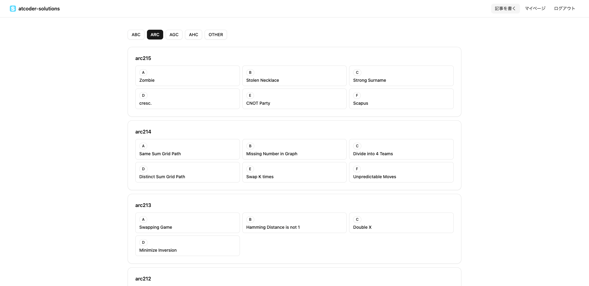

# AtCoder Solutions

AtCoder Solutions is a full-stack platform, inspired by Qiita, where users can post, share, and discover editorials for AtCoder problems. In addition to publishing and browsing editorials, it also provides community features such as likes and comments.

In the future, I plan to develop a user script that allows editorials posted on this service to be displayed directly on the official AtCoder editorial pages.

