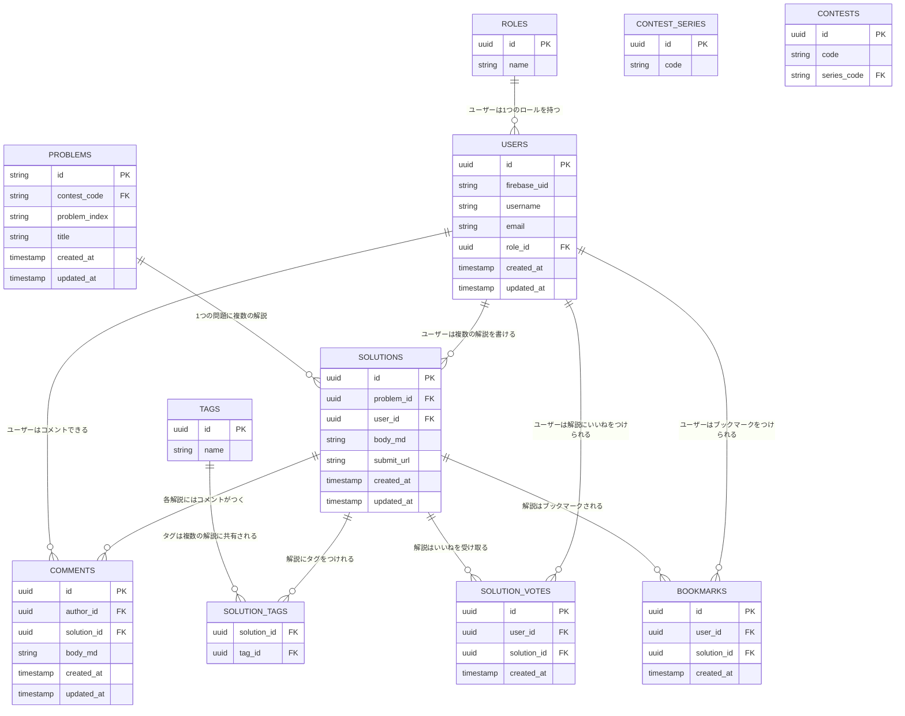

see: https://mermaid.live/edit

- 1解説に1ユーザーがつけられるいいねは1回だけ(取り消し可)
- 1解説に1ユーザーがブックマークできるのは1回だけ(取り消し可)

```mermaid
erDiagram
  ROLES ||--o{ USERS : "ユーザーは1つのロールを持つ"
  USERS ||--o{ SOLUTIONS : "ユーザーは複数の解説を書ける"
  PROBLEMS ||--o{ SOLUTIONS : "1つの問題に複数の解説"
  SOLUTIONS ||--o{ COMMENTS : "各解説にはコメントがつく"
  USERS ||--o{ COMMENTS : "ユーザーはコメントできる"
  USERS ||--o{ SOLUTION_VOTES : "ユーザーは解説にいいねをつけられる"
  SOLUTIONS ||--o{ SOLUTION_VOTES : "解説はいいねを受け取る"
  USERS ||--o{ BOOKMARKS : "ユーザーはブックマークをつけられる"
  SOLUTIONS ||--o{ BOOKMARKS : "解説はブックマークされる"
  SOLUTIONS ||--o{ SOLUTION_TAGS : "解説にタグをつけれる"
  TAGS ||--o{ SOLUTION_TAGS : "タグは複数の解説に共有される"

  USERS {
    uuid id PK
    string firebase_uid
    string username
    string email
    uuid role_id FK
    timestamp created_at
    timestamp updated_at
  }

  ROLES {
    uuid id PK
    string name
  }

  CONTEST_SERIES {
    uuid id PK
    string code
  }

  CONTESTS {
    uuid id PK
    string code
    string series_code FK
  }

  PROBLEMS {
    string id PK
    string contest_code FK
    string problem_index
    string title
    timestamp created_at
    timestamp updated_at
  }

  SOLUTIONS {
    uuid id PK
    uuid problem_id FK
    uuid user_id FK
    string body_md
    string submit_url
    timestamp created_at
    timestamp updated_at
  }

  SOLUTION_VOTES {
    uuid id PK
    uuid user_id FK
    uuid solution_id FK
    timestamp created_at
  }

  BOOKMARKS {
    uuid id PK
    uuid user_id FK
    uuid solution_id FK
    timestamp created_at
  }

  COMMENTS {
    uuid id PK
    uuid author_id FK
    uuid solution_id FK
    string body_md
    timestamp created_at
    timestamp updated_at
  }

  TAGS {
    uuid id PK
    string name
  }

  SOLUTION_TAGS {
    uuid solution_id FK
    uuid tag_id FK
  }
```
